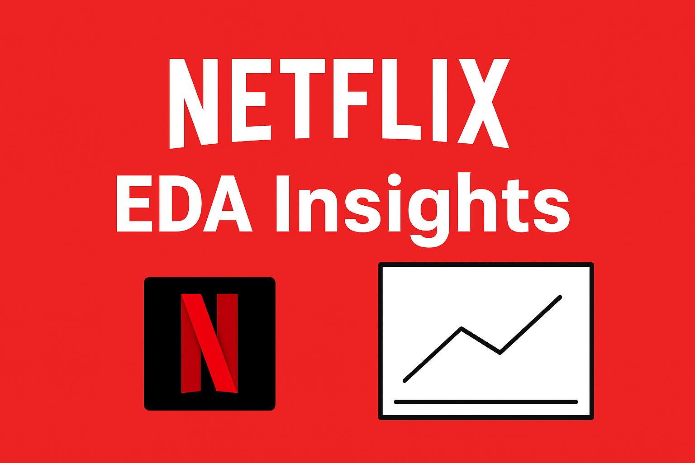

<p align="center">
  
</p>


# 📊 Netflix Exploratory Data Analysis (EDA)

This project explores the **Netflix dataset** containing over **8,000+ movies and TV shows**, performing **Exploratory Data Analysis (EDA)** to identify patterns, trends, and insights about Netflix’s global catalog.

---

## 🚀 Project Overview
Air pollution may be the bigger threat globally, but binge-watchers care more about Netflix 😉.  
In this project, we dig into Netflix’s content library to uncover:
- Growth of Netflix content over the years  
- Most popular genres & categories  
- Country-wise distribution of Netflix titles  
- Duration analysis of Movies vs TV Shows  
- Seasonal & trend patterns in releases  
- Data visualizations to present findings  

---

## 📂 Dataset
The dataset is available on [Kaggle](https://www.kaggle.com/shivamb/netflix-shows) and includes:
- Title, Type (Movie/TV Show)  
- Director, Cast, Country  
- Date added, Release year  
- Duration (minutes/seasons)  
- Genre (listed_in)  
- Description  

---

## 🔍 Key Insights
- **Content Growth**: Netflix’s library has rapidly grown since 2015.  
- **Movies vs TV Shows**: Movies dominate the catalog, but TV Shows have been increasing in recent years.  
- **Genres**: Dramas and International movies are among the top genres.  
- **Countries**: The USA and India contribute the largest share of Netflix content.  
- **Durations**: Most movies are around 90–120 minutes; most TV shows are limited series (1–2 seasons).  
- **Seasonal Trends**: Content releases peak in certain months, especially towards year-end.  

---

## 📊 Visualizations
Some of the key visualizations include:
- Bar charts of top genres  
- Heatmap of country-wise content distribution  
- Boxplots of movie durations  
- Histograms of release years  
- Line plots showing Netflix’s growth over time  

---

## 🛠️ Tech Stack
- **Python**  
- **Pandas** (data cleaning & wrangling)  
- **Matplotlib & Seaborn** (visualizations)  
- **Jupyter Notebook** (analysis & reporting)  

---

## 📌 How to Run
1. Clone this repo:  
   ```bash
   git clone https://github.com/Maazthepal/Netflix_EDA.git
   cd Netflix_EDA
   pip install -r requirements.txt
